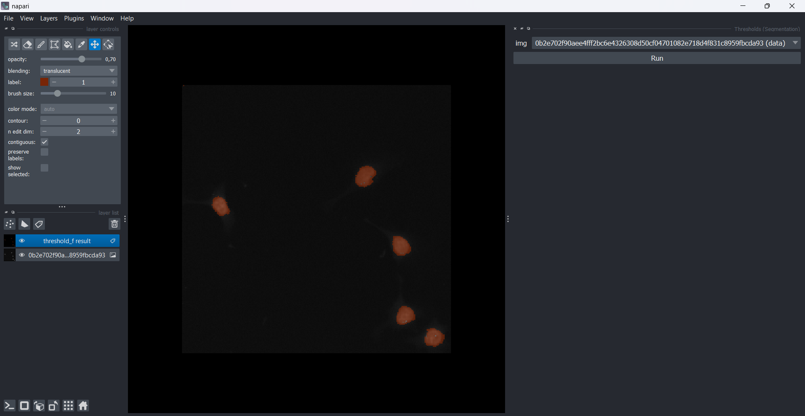

# Exercice 3 : Créer un widget pour segmenter une image à partir d'un modèle deep learning



## 1- `_widget.py`

Nous allons créer un widget pour segmenter une image

### Segmentation avec modèle UNet

L'algorithme prends deux entrées :
- une image de type array
- le modèle entrainé

Dans napari, **image** d'entrée est présenté comme un objet `napari.types`. Dans le décorateur magicgui, nous introduisons une seule variable et un bouton d'exécution :

- `img_`: Image dans la fenêtre napari qui est de type `ImageData` de `napari.types`.
- `call_button`: Bouton pour exécuter le widget.

⚠️ N'oubliez pas d'importer `ImageData` et `LabelsData` dans `_widget.py`: `from napari.types import ImageData, LabelsData`

Nous souhaitons aussi joindre dans notre plugin un modèle deep learning **unet_best.keras**. Nous déposerons le modèle dans le dossier **napari_seg**. Un script écrit à l'avance **_paths.py**  permettra de définir automatiquement le chemin absolu du modèle **unet_best.keras**.

```
from napari.types import ImageData, LabelsData
import napari_seg._paths as paths

@magic_factory(call_button="Run")
def threshold_f(img_: ImageData) -> LabelsData:    
    ###
    SCRIPT
    ###
    return mask
```

Plus d'information pour [napari.types](https://napari.org/stable/api/napari.types.html)

## 2- `napari.yaml`

Dans la section contribution, nous ajoutons notre widget qui porte le nom de notre fonction:
```
  - id: napari-seg.my_widget #must be unique !
    title: Thresholds
    python_name: napari_seg._widget:threshold_f

```
En particulier, dans le backend, notre widget porte le nom : 
```
napari-seg.my_widget
```
Dans la section widgets, nous ajoutons les informations pour afficher notre widget :
```
  - command: napari-seg.my_widget #identity backend
    display_name: Thresholds
```

*See correction: `napari.yaml`*

## 3- `__init__.py`

A la rigueur, nous ajoutons notre fonction dans l'ensemble des fonctions 
```
__version__ = "0.0.1"
from ._widget import ExampleQWidget, example_magic_widget, threshold_f

__all__ = (
    "ExampleQWidget",
    "example_magic_widget",
    "threshold_f",
)
```

*See correction: `__init__.py`*

## 4-  `pyproject.toml`

Ce fichier contient les librairies indispensables pour le bon fonctionnement du code. Dans la section `[dependencies]`, nous ajoutons nos librairies utilisées telles que `scikit-image`
```
dependencies = [
    "numpy",
    "magicgui",
    "qtpy",
    "scikit-image",
    "tensorflow",
    "opencv-python-headless"
]
```

*See correction: `setup.cfg`*

## 5-  `test_widget.py`

Quand le widget fonctionne bien, il est nécessaire d'ajouter quelques tests pour vérifier si le widget fonctionne après modification du code. 

### Threshold

Supposons que le code a subi un changement. Nous ajoutons un test qui vérifie si la sortie est toujours un objet de type numpy array et binaire.

```
import pytest
from napari.types import ImageData, LabelsData
from napari.layers import Image, Labels
from napari_seg._widget import threshold_f

# We create a RGB image randomly
@pytest.fixture
def im_rgb():
    return ImageData(np.random.randint(256,size=(256,256,3)))

# We establish our function by highlighting the arguments and argument keys (arg of magicgui)
def get_er(*args, **kwargs):
    er_func = threshold_f()
    return er_func(*args, **kwargs)

# We run a test to check if output is numpy array and binary
def test_threshold(im_rgb):
    my_widget_thd = get_er(im_rgb,filter_selected='otsu')
    #check if output is numpy array
    assert type(my_widget_thd)==np.ndarray
    #check if output is binary
    assert len(np.unique(my_widget_thd))==2
```

Le test s'execute en utilisant pytest :
```
pip install ".[testing]" #Be at napari-threshold directory level
```
Commande d'execution du test :
```
pytest .
```

*See correction: `test_widget.py`*

## 6-  `README.md`

Rédiger quelques informations importantes pour informer aux utilisateurs sur le fonctionnement du plugin et sa prise en main.

*See correction: `README.md`*
